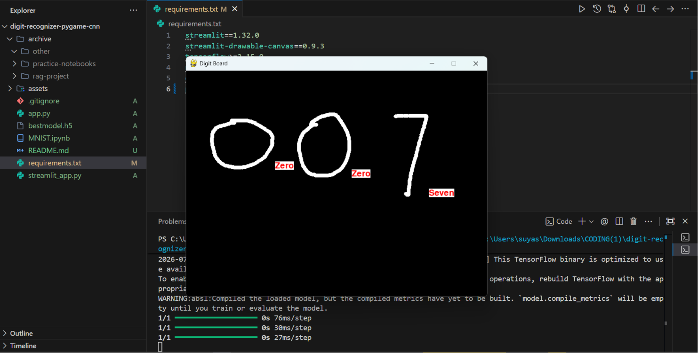

# ✍️ Handwritten Digit Recognizer (CNN + Live Drawing Canvas)

A deep learning project that trains a Convolutional Neural Network on the MNIST dataset and lets you **draw a digit and get an instant prediction**, with two different interfaces to try it: a desktop Pygame app and a browser-based Streamlit app.

> **Scope note:** this project recognizes single handwritten **digits (0–9)**, not general text/characters — think of it as a live MNIST classifier, not a full OCR engine.

---

## 🎥 Demo

Add a few screenshots of both interfaces in action below, and/or link a short demo video (e.g. uploaded to YouTube) to show the live drawing + prediction working.

```

```

📺 **Demo video:** *(add your YouTube link here)*

> Note: the Streamlit app isn't deployed to a public URL yet — run it locally with the instructions below. (Streamlit Community Cloud is free and would let you add a "try it live in your browser" link here if you deploy it later.)

---

## 🧠 How It Works

The project is split into two parts:

### 1. Model Training (Jupyter Notebook)

- **Dataset:** `keras.datasets.mnist` — 60,000 training images + 10,000 test images, each 28×28 grayscale.
- **Preprocessing:**

  - Normalized pixel values to `[0, 1]` (divide by 255)
  - Expanded dimensions from `(28, 28)` → `(28, 28, 1)` to add the channel axis required by Conv2D
  - One-hot encoded labels using `keras.utils.to_categorical`
- **Architecture (Sequential CNN):**

  | Layer        | Details                                              |
  | ------------ | ---------------------------------------------------- |
  | Conv2D       | 32 filters, kernel 3×3, ReLU, input shape (28,28,1) |
  | MaxPooling2D | pool size 2×2                                       |
  | Conv2D       | 64 filters, kernel 3×3, ReLU                        |
  | MaxPooling2D | pool size 2×2                                       |
  | Flatten      | —                                                   |
  | Dropout      | 0.25 (prevents overfitting)                          |
  | Dense        | 10 units, Softmax (output layer)                     |

  **Total params: 34,826 (136 KB)** — small enough to load instantly, no GPU required for inference.
- **Compilation:** Adam optimizer, categorical cross-entropy loss, accuracy metric
- **Callbacks:** `EarlyStopping` (monitors `val_accuracy`, `min_delta=0.01`, patience = 4) and `ModelCheckpoint` (saves best model as `bestmodel.h5`, `save_best_only=True`)
- **Training:** up to 50 epochs, 30% validation split
- **Result:** **99.13% test accuracy**, **0.0513 test loss** on the held-out MNIST test set

### 2. Real-Time Inference (Pygame App)

- Opens a 640×480 drawing canvas
- Tracks mouse motion to draw strokes in white on black
- On mouse-release, computes a bounding box (with 5px padding) around the drawn stroke
- Extracts that region as a pixel array, **thresholds it to pure binary (0/255)**, pads it, resizes to 28×28, and normalizes it
- Feeds it into the trained `.h5` model (loaded relative to the script's own directory, so it works regardless of your working directory) → `argmax` on the softmax output → predicted digit
- Displays the prediction as a **word label** (e.g. "Five", not "5") next to the drawing
- Press **`N`** to clear the canvas and draw the next digit
- `IMAGESAVE` (save each drawn digit as a PNG) and `PREDICT` (run inference) are flags at the top of `app.py` — toggle them in code if you want to collect your own dataset instead of predicting live

### 3. Browser Alternative (Streamlit App)

A second, browser-based interface using `streamlit-drawable-canvas` — no Pygame window required, runs in any browser via `streamlit run`.

- 280×280 freedraw canvas, white strokes on black, 14px stroke width
- On each redraw, crops to the drawing's bounding box (15px padding), resizes to 28×28, pads, resizes again, and normalizes — matching the same preprocessing pipeline as the training data
- Displays the **predicted digit and its confidence percentage**
- Sidebar shows the exact 28×28 image the model sees, for a sanity check on preprocessing
- Model is cached with `@st.cache_resource` so it only loads once per session, not on every redraw

---

## 🛠️ Tech Stack

- **Python 3.x**
- **TensorFlow / Keras** — model building & training
- **NumPy, Matplotlib** — data handling & visualization
- **Pygame** — desktop interactive drawing canvas
- **Streamlit + streamlit-drawable-canvas** — browser-based interactive drawing canvas
- **OpenCV (cv2)** — image resizing/preprocessing during inference

---

## 📂 Project Structure

```
digit-recognizer-pygame-cnn/
├── MNIST.ipynb                # Notebook: data prep, CNN, training
├── app.py                     # Desktop app (Pygame): draw + real-time prediction
├── streamlit_app.py           # Browser app (Streamlit): draw + real-time prediction
├── bestmodel.h5                # Saved trained model (< 1 MB)
├── requirements.txt
├── assets/
│   └── demo-screenshot.png
└── README.md
```

---

## ⚙️ Installation & Usage

```bash
# Clone the repo
git clone https://github.com/suyashsahu00/digit-recognizer-pygame-cnn.git
cd digit-recognizer-pygame-cnn

# Install dependencies
pip install -r requirements.txt

# Option A: run the desktop app (Pygame)
python app.py

# Option B: run the browser app (Streamlit)
streamlit run streamlit_app.py
```

**Pygame app controls:**

- Draw with your mouse (left-click and drag)
- Release the mouse to see the prediction
- Press `N` to clear the board
- Close the window to quit

**Streamlit app controls:**

- Draw directly on the canvas in your browser
- Prediction and confidence % update automatically after each stroke
- Use the trash/reset icon on the canvas toolbar to clear it

---

## 📊 Results

| Metric           | Value  |
| ---------------- | ------ |
| Test Accuracy    | 99.13% |
| Test Loss        | 0.0513 |
| Total Parameters | 34,826 |

*(A confusion matrix image would still strengthen this section — much more convincing than a single accuracy number, and easy to generate with `sklearn.metrics.confusion_matrix` + `seaborn.heatmap` on your test predictions.)*

---

## 📄 License

*(Choose one — MIT is the common default for portfolio ML projects. State it here and add a LICENSE file.)*
